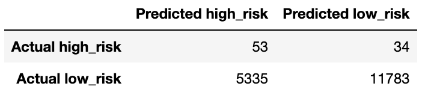
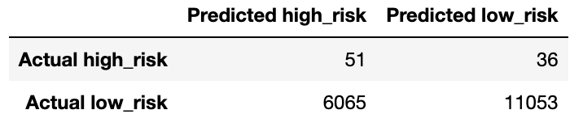
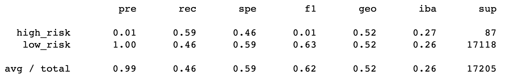
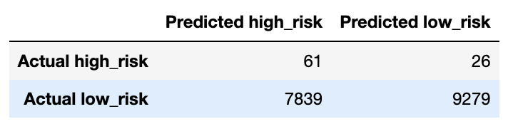
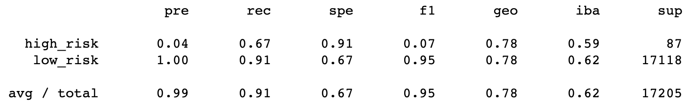

# Credit_Risk_Analysis
## 1. Overview of Project
The purpose of this project is 

## 2. Learning Model Results

### 2.1 RandomOverSampler Model

  

  

  

### 2.2 SMOTE Model

  

  

  

### 2.3 ClusterCentroids Model

  

  

  

### 2.4 SMOTEENN Model

  

  

  

### 2.5 SBalancedRandomForestClassifier  Model

  

  

  

### 2.6 EasyEnsembleClassifier Model

  

  

  

## 3. Sumary

