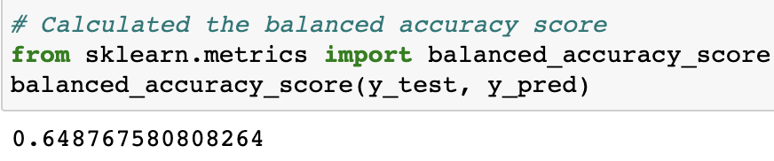
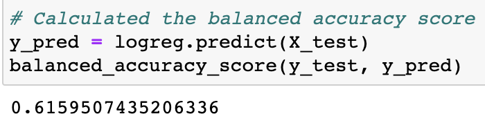
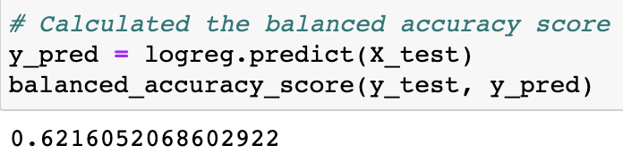
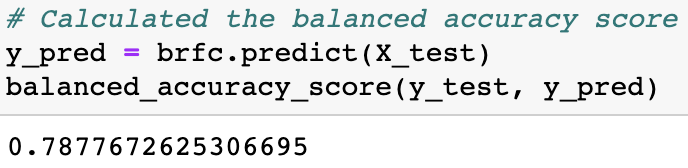
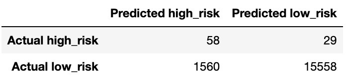
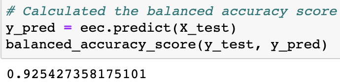

# Credit_Risk_Analysis
## 1. Overview of Project
The purpose of this project is to build and evaluate several machine learning models to predict credit risk.

## 2. Learning Model Results

### 2.1 RandomOverSampler Model
* In this model the balanced accuracy score is 65%.
* The high_risk precision is about 1% only with 61% sensitivity which makes a F1 of 2% only.
* Since we have a high number of the low_risk population, its precision is almost 100% with a sensitivity of 69%.

  

  

  

### 2.2 SMOTE Model

* For Smote model The balanced accuracy score is 62%.
* The high_risk precision is 1% only with 59% sensitivity which makes a F1 of 2% only.
* Due to the high number of the low_risk population, its precision is almost 100% with a sensitivity of 65%.

  

  

  

### 2.3 ClusterCentroids Model

* Here the balanced accuracy score is down to about 52%.
* The high_risk precision is still 1% only with 59% sensitivity which makes a F1 of 1%.
* The low_risk sensitivity is only 46%.

  

  

  

### 2.4 SMOTEENN Model

The balanced accuracy score is about 62%.
The high_risk precision is still 1% only with 68% sensitivity which makes a F1 of only 2%.
Due to the high number of false positives, the low_risk sensitivity is 57%.

  

  

  

### 2.5 SBalancedRandomForestClassifier Model

* The balanced accuracy score improved to about 79%.
* The high_risk precision has increased a litle with 67% sensitivity which makes a F1 of only 7%.
* The low_risk sensitivity is now 91% with 100% presicion.

  

  

  

### 2.6 EasyEnsembleClassifier Model

* For this model the balanced accuracy score is high to 92 almost 93%.
* The high_risk precision is still low at 7% only with 91% sensitivity which makes a F1 of only 14%.
* Due to a lower number of false positives, the low_risk sensitivity is now 94% with 100% presicion.

  

  

  

## 3. Summary
In Summary all models used to perform the credit risk analysis show low precision in determining if a credit risk is high.
The Ensemble models brought a lot more improvement specially on the sensitivity of the high risk credits whereas the EasyEnsembleClassifier model shows a recall of 92% so it detects almost all high risk credit. 
Due to a low precision, a lot of low risk credits are still falsely detected as high risk which would penalize the bank's credit strategy.
